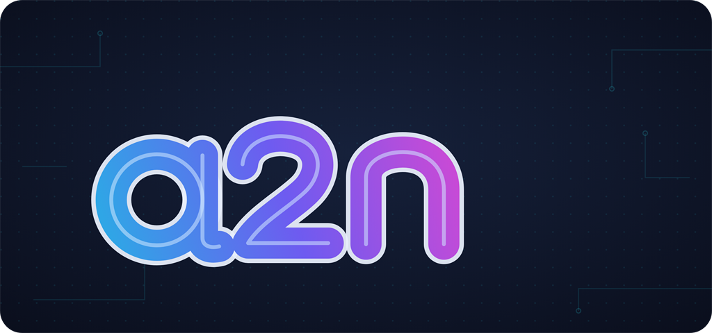

<p align="center">
  
</p>

# a2n.Vista

> *Define a view, get an API. Type-safe, AOT-friendly, grid-agnostic projections for ASP.NET Core.*

`a2n.Vista` is a .NET library for building back-office applications around **Views** — complex LINQ projections — with grid-agnostic UI integration, secure-by-default behavior, and AOT-clean output.

Vista is the design successor to [`a2n.DynData`](https://github.com/anwarminarso/a2n.DynData) — not a mechanical rewrite, but a redesign focused on its unique differentiators. See [`ROADMAP.md`](./ROADMAP.md) for the full context.

## Status

**v0.x (Foundation), in progress.** Build is green on .NET 8/9/10; the Northwind read **and** write self-tests pass. The core packages are working end to end:

- **Core** — `View`/`ViewBuilder`/`ViewTemplate`, metadata, the filter contract, the `IViewExecutor`/`IViewScope` ports, and the write seam (`WriteMapper`/`IWriteFacetRegistry`).
- **EntityFrameworkCore** — executes Views over EF Core: List + Detail-by-key, deterministic paging, filter/sort/search, composite keys, provider-aware (`IQueryDialect` + optional Npgsql), and the write facet (Create/Update/Delete with a `MapWritable` whitelist, optimistic concurrency, single `SaveChanges`).
- **AspNetCore** — action-style endpoint mapping (`POST list/detail/export/create/update/delete` + `GET metadata`), RFC 7807 error mapping, and secure-by-default one-door authorization (fail-closed at startup in non-Development).
- **SourceGenerators (Pillar 3, complete)** — every planned phase landed: shape-driven export accessors, executable typed Style B (`ICompiledViewExecutionPlan` + masking runtime + single-source PK auto-derivation), the generated write mapper, the HTTP-surface phase (a generated Core-only dispatch invoker + an AOT-clean serialization seam), the per-view `JsonTypeInfo` phase (a generated per-view `IJsonTypeInfoResolver` that makes the developer `App_Json_Context` **optional**), and the final Style A coverage phase (the nameable central-template subset). The **full typed Style B `request → authorize → execute → serialize` path is AOT-clean** (IL2026/IL3050-free), including serialization with no hand-authored context; reflection remains only as a fallback for anonymous Style A read serialization (permanently `[RequiresUnreferencedCode]` by design).
- **OpenApi** — an opt-in `a2n.Vista.OpenApi` package emits a deterministic **OpenAPI v3.x** document for every mapped View (served off-by-default at `GET /openapi/v1.json`, additive-only).
- **Client.TypeScript** — a standalone CLI that generates a framework-agnostic, strongly-typed **TypeScript client** from the emitted OpenAPI document: per-view DTO types, the fixed Vista envelopes, the `FilterNode` union, and a per-view typed client over an injectable HTTP transport. A pure downstream consumer (no Vista project reference); read facets by default, write facets opt-in, secure-by-default, deterministic output.
- **Adapters (Pillar 2, client half)** — grid adapters translate a grid's native request/response shape into the neutral Vista contract. Two are real: **DataTables.NET** (jQuery DataTables + QueryBuilder) and **AG Grid** (`a2n.Vista.Adapters.AgGrid` — server-side row model: block paging, `filterModel`/`sortModel`, quick filter), each Core-only and exposed through the same host glue at `POST {route}/{suffix}`.
- **CI / publish** — GitHub Actions workflows build the solution and run the test suites across net8/9/10, and pack + push the shipping packages to nuget.org via NuGet Trusted Publishing (OIDC, no stored API key).

Runnable examples: [`src/Examples/Northwind`](./src/Examples/Northwind) — read-only and writable Views over the real Northwind database, with an end-to-end self-test (`dotnet run -- selftest`) that exercises the generated dispatch and serialization; and [`src/Examples/a2n.Vista.Examples.AgGridNorthwind`](./src/Examples) — a three-page **Northwind sample showcase** (Simple Wiring, View Browser, Custom Renderer) that drives DataTables.NET + jQuery-QueryBuilder and AG Grid over several Northwind Views, populated from a `GET /api/showcase/views` catalog (secure-by-default: only registered Views appear).

Not started / skeleton only: the remaining UI adapters (Pillar 2, client half — DataTables.NET and AG Grid are real; MudBlazor, Telerik, Syncfusion, TanStack, PrimeNG, OData, GraphQL are scaffolds), observability (OpenTelemetry), and versioning/deprecation.

Specs under refinement live in [`docs/spec/`](./docs/spec/).

## Three Pillars

1. **View as a First-Class Citizen** — declarative LINQ projections as the core unit, secure-by-default, strongly typed.
2. **Grid-Agnostic UI Integration** — a neutral core with separate adapters per grid ecosystem (DataTables, AG Grid, MudBlazor, Telerik, Syncfusion, TanStack, PrimeNG, OData, GraphQL).
3. **AOT-First** — source generators for metadata and endpoints, with no runtime reflection on the hot path.

## Solution Layout

```
src/
  a2n.Vista.Core                 ← engine: view, query, expression, metadata
  a2n.Vista.AspNetCore           ← endpoint mapping (MVC + Minimal API)
  a2n.Vista.EntityFrameworkCore  ← EF Core integration
  a2n.Vista.SourceGenerators     ← compile-time codegen, AOT
  a2n.Vista.Newtonsoft           ← optional, for legacy
  Adapters/
    a2n.Vista.Adapters.*         ← UI adapters per ecosystem
  a2n.Vista.Client.TypeScript    ← TS codegen tool
  Examples/
    Northwind                    ← end-to-end example (EF + AspNetCore)
  Tests/
    a2n.Vista.Tests              ← unit & integration tests
```

## Documentation

- [ROADMAP](./ROADMAP.md) — vision, positioning vs competitors, release strategy
- [CONTRIBUTING](./CONTRIBUTING.md) — how to build, test, and submit changes
- [CHANGELOG](./CHANGELOG.md) — notable changes per release
- [SECURITY](./SECURITY.md) — how to report a vulnerability

**Specs:**

- [01 — View](./docs/spec/01-view.md) — View concept and API surface (Pillar 1)
- [02 — Filter & Query Engine](./docs/spec/02-filter-and-query.md) — filter contract, paging/sort/search (Pillar 2, server half)
- [03 — Source Generator](./docs/spec/03-source-generator.md) — compile-time codegen (Pillar 3)
- [04 — Adapter Contract](./docs/spec/04-adapter-contract.md) — UI adapter contract (Pillar 2, client half)
- [05 — ASP.NET Core Mapping](./docs/spec/05-aspnetcore-mapping.md) — HTTP composition: read, write, auth, error
- [10 — Operations & Observability](./docs/spec/10-operations-and-observability.md) — cross-cutting
- [11 — Versioning & Deprecation](./docs/spec/11-versioning-and-deprecation.md) — cross-cutting

## Building

Requires the .NET SDK (the solution multi-targets .NET 8, 9, and 10).

```sh
dotnet build src/a2n.Vista.slnx
dotnet test src/a2n.Vista.slnx
```

See [CONTRIBUTING](./CONTRIBUTING.md) for the full workflow.

## License

Licensed under the **GNU Lesser General Public License v3.0** (LGPL-3.0-or-later).
See [LICENSE](./LICENSE), [COPYING](./COPYING), and [NOTICES](./NOTICES.md).
